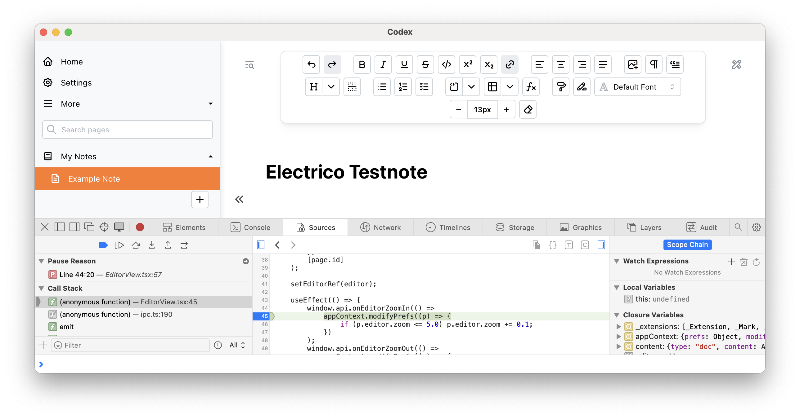
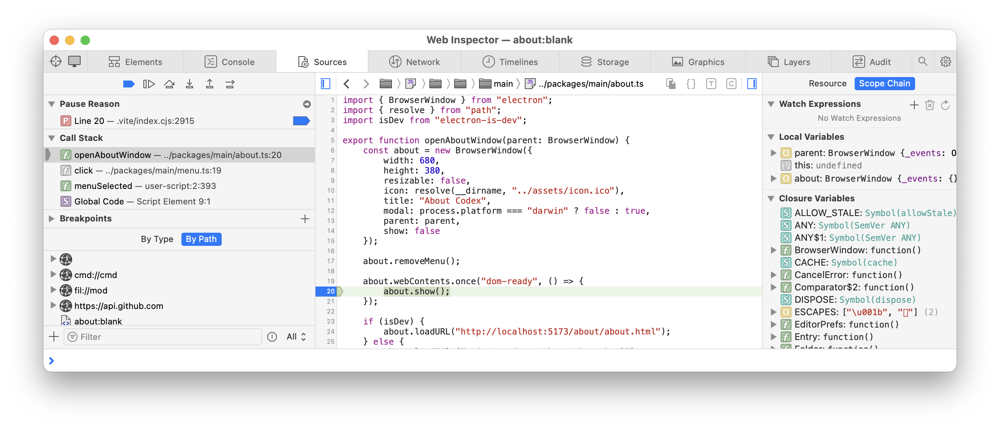

	
     
	A Lightweight Electron 'compatible' App Container 
	<small>Thomas Tschurtschenthaler</small>

## Overview

Electrico is an experimental alternative App Container for [Electron](https://www.electronjs.org/) Apps.

It is written in **Rust** and **Javascript** on top of the cross-platform WebView rendering library [Wry/Tauri](https://crates.io/crates/wry).

All Javascript code is executed within embedded system-native Web Views - one for the NodeJS 'backend', one for each Electron App-GUI browser window.
The Electron and Node APIs are emulated with corresponding Rust API calls. All communcation between the Web Views and Rust runs on synchronous and asynchronous XMLHttpRequests.

**Electrico comes lightweight - no need to bundle Node.js and Chromium binaries with the App executable!**

### Features
-   build size down to about 10MB
-   cross platform for linux, macos, windows, ios and android
-   debugging frontend and backend with native browser dev-tools

As for now some basic Electron and Node APIs are - partly - implemented:
-   common Electron App startup and BrowserWindow methods
-   Electron IPC and preload.js
-   parts of the Electron dialog API (OpenDialog, SaveDialog, MessageBox)
-   basic parts of NodeJS file system API (access, fstat, mkdir, readfile, writefile, watch)
-   parts of NodeJS process API (child_process spawn)

### Try out the Test App (Folder /Resources)

The Test App is configured to start up by default when Electrico is started from the project folder

	cargo run

When Electrico is started in debug mode, it opens a browser dev tools window for the 'node backend' where debugging takes place. Also all GUI windows are shown with dev tools.

To start Electrico without dev tools, run

	cargo run --release

## Test with App 'Codex'
As a more ambitious showcase I chose [Codex](https://codexnotes.com/) by Josh Vickery.

Clone [Codex Github](https://github.com/jcv8000/Codex) and give it a try.

From the Codex repository folder start Codex in DEV mode:

	pnpm dev

Codex starts up with Electron - you may close the Electron Window as we only need the DEV-Server running on port **5173**.
Then point the link in **ResourceLink.json** to the Codex repository folder and start up Electrico:

	cargo run

